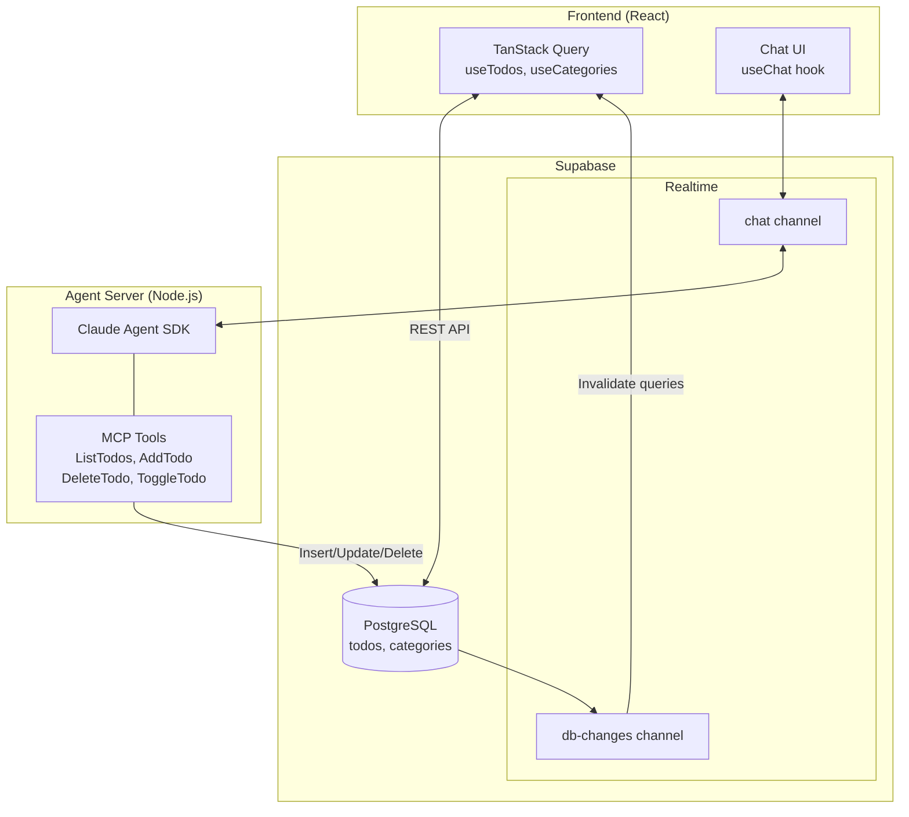

# Supabase Todo App with AI Chat Agent

A React + TypeScript todo application with an integrated AI chat agent that can manage your todos. Uses Supabase for storage and real-time synchronization.

## Features

- **Todo Management**: Create, complete, and delete todos with category support
- **Category System**: Organize todos by custom categories
- **AI Chat Agent**: Chat with Claude to manage your todos using natural language
- **Real-time Sync**: UI updates automatically when the agent modifies data

## Tech Stack

### Frontend
- React 18 + TypeScript
- Vite
- Tailwind CSS v4
- Supabase JS Client
- TanStack Query (React Query) backed by Supabase queries

### Database
- Supabase (PostgreSQL)
- Supabase Realtime for live updates

### Agent Server
- Node.js
- Claude Agent SDK (`@anthropic-ai/claude-agent-sdk`)
- MCP (Model Context Protocol) tools
- Supabase Realtime Broadcast

## Architecture



### Real-time Flows

**Chat Messages (Broadcast)**
1. User sends message → Frontend publishes to Supabase Broadcast channel
2. Agent server receives message via Broadcast subscription
3. Claude processes and responds
4. Server publishes response to Broadcast channel
5. Frontend receives and displays response

**Database Sync (Postgres Changes)**
1. Agent modifies todos via MCP tools → Supabase DB updated
2. Supabase Realtime detects change → publishes Postgres Changes event
3. Frontend receives event → TanStack Query invalidates cache → UI refreshes

## Prerequisites

- Node.js 18+
- Docker (for local Supabase)
- Anthropic API key

## Setup

### 1. Install Dependencies

```bash
# Frontend dependencies
npm install

# Server dependencies
cd server && npm install && cd ..
```

### 2. Start Supabase

```bash
npx supabase start
```

This will output connection details. Note the `API URL` and `anon key`.

### 3. Configure Environment

Create `.env` in the project root:

```env
VITE_SUPABASE_URL=http://127.0.0.1:54321
VITE_SUPABASE_ANON_KEY=<your-anon-key>
```

Create `server/.env`:

```env
ANTHROPIC_API_KEY=<your-anthropic-api-key>
SUPABASE_URL=http://127.0.0.1:54321
SUPABASE_ANON_KEY=<your-anon-key>
```

### 4. Run Database Migrations

Migrations run automatically when Supabase starts. To reset:

```bash
npx supabase db reset
```

## Running the App

### Start the Agent Server

```bash
cd server && npm run dev
```

Server runs on `http://localhost:3001`

### Start the Frontend

```bash
npm run dev
```

Frontend runs on `http://localhost:5173`

## MCP Tools

The AI agent has access to these tools for managing todos:

| Tool | Description |
|------|-------------|
| `ListTodos` | List all todos, optionally filtered by category or completion status |
| `AddTodo` | Create a new todo with optional category |
| `DeleteTodo` | Delete a todo by ID |
| `ToggleTodo` | Mark a todo as complete or incomplete |

## Usage

1. **Todos Tab**: Manually create and manage todos with categories
2. **Chat Tab**: Talk to the AI agent to manage todos:
   - "Show me all my todos"
   - "Add a todo to buy groceries"
   - "Mark the first todo as complete"
   - "Delete all completed todos"

## Project Structure

```
.
├── src/
│   ├── components/       # React components
│   ├── hooks/            # Custom hooks (useTodos, useCategories, useChat, useRealtimeSync)
│   ├── lib/              # Supabase client
│   ├── types/            # TypeScript types
│   └── App.tsx           # Main app component
├── server/
│   ├── index.ts          # Agent server with Claude Agent SDK
│   └── tools.ts          # MCP tool definitions
├── supabase/
│   └── migrations/       # Database migrations
└── package.json
```

## Development Notes

- **Zod Version**: The Claude Agent SDK requires Zod v3 (not v4). The server uses `zod@3`.
- **Tool Permissions**: MCP tools use explicit `allowedTools` array for security.
- **Session Management**: Chat sessions are maintained using the SDK's `resume` option.
